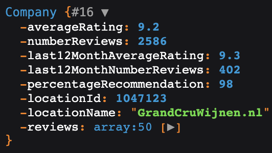
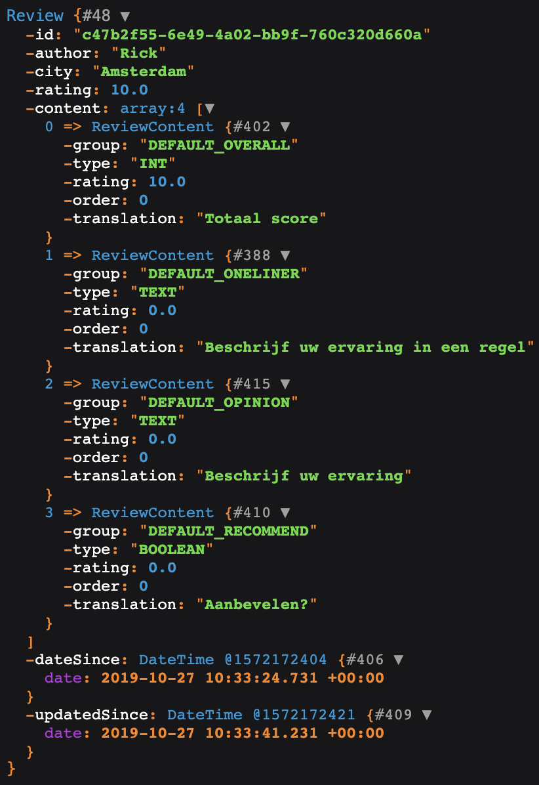

# A PHP KiyOh API
<!-- ALL-CONTRIBUTORS-BADGE:START - Do not remove or modify this section -->
[](#contributors-)
<!-- ALL-CONTRIBUTORS-BADGE:END -->
[](https://travis-ci.com/JKetelaar/PHP-KiyOh-API)

## How to install?
Install this project using composer: `composer require jketelaar/php-KiyOh-api`.

Then start using the API using something like:

```php
<?php
/**
 * @author JKetelaar
 */
require_once('vendor/autoload.php');

$connector = 'xxxxxxxx'; // Change with your hash
$count = 50; // Amount of reviews you want to get

$KiyOh = new \JKetelaar\KiyOh\KiyOh($connector, $count);

$company = $KiyOh->getCompany();

var_dump($company->getReviews()[0]->getId());

var_dump($company->getLocationName());
var_dump($company->getAverageRating());
var_dump($company->getNumberReviews());
```

### Example outputs

#### Company output
```php
var_dump($KiyOh->getCompany());
```



#### Review output
```php
var_dump($KiyOh->getCompany()->getReviews()[0]);
```


## Contributors ✨

Thanks goes to these wonderful people ([emoji key](https://allcontributors.org/docs/en/emoji-key)):

<!-- ALL-CONTRIBUTORS-LIST:START - Do not remove or modify this section -->
<!-- prettier-ignore-start -->
<!-- markdownlint-disable -->
<table>
  <tr>
    <td align="center"><a href="http://jketelaar.nl/"><br /><sub><b>Jeroen Ketelaar</b></sub></a><br /><a href="#maintenance-JKetelaar" title="Maintenance">🚧</a> <a href="https://github.com/JKetelaar/PHP-KiyOh-API/pulls?q=is%3Apr+reviewed-by%3AJKetelaar" title="Reviewed Pull Requests">👀</a> <a href="https://github.com/JKetelaar/PHP-KiyOh-API/commits?author=JKetelaar" title="Code">💻</a> <a href="#infra-JKetelaar" title="Infrastructure (Hosting, Build-Tools, etc)">🚇</a> <a href="#ideas-JKetelaar" title="Ideas, Planning, & Feedback">🤔</a></td>
    <td align="center"><a href="https://github.com/menno-ll"><br /><sub><b>Menno van den Ende</b></sub></a><br /><a href="https://github.com/JKetelaar/PHP-KiyOh-API/commits?author=menno-ll" title="Code">💻</a> <a href="#ideas-menno-ll" title="Ideas, Planning, & Feedback">🤔</a></td>
  </tr>
</table>

<!-- markdownlint-enable -->
<!-- prettier-ignore-end -->
<!-- ALL-CONTRIBUTORS-LIST:END -->

This project follows the [all-contributors](https://github.com/all-contributors/all-contributors) specification. Contributions of any kind welcome!
